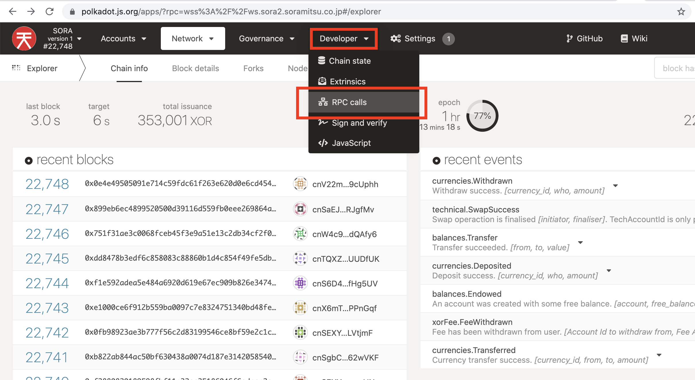
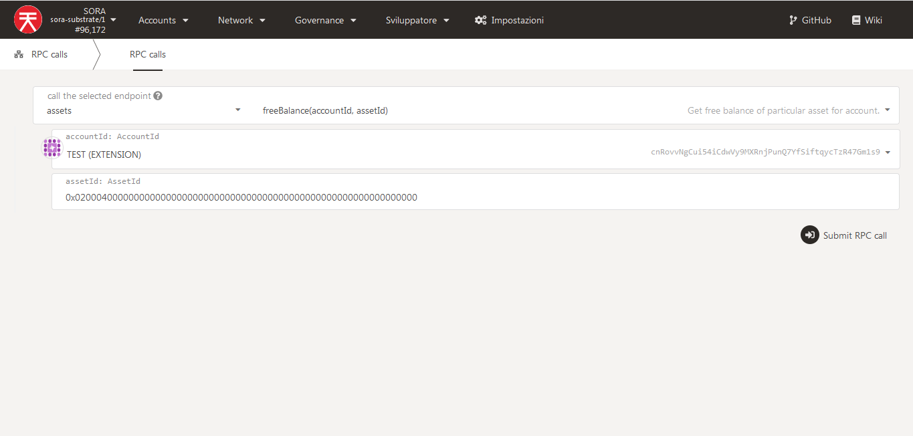
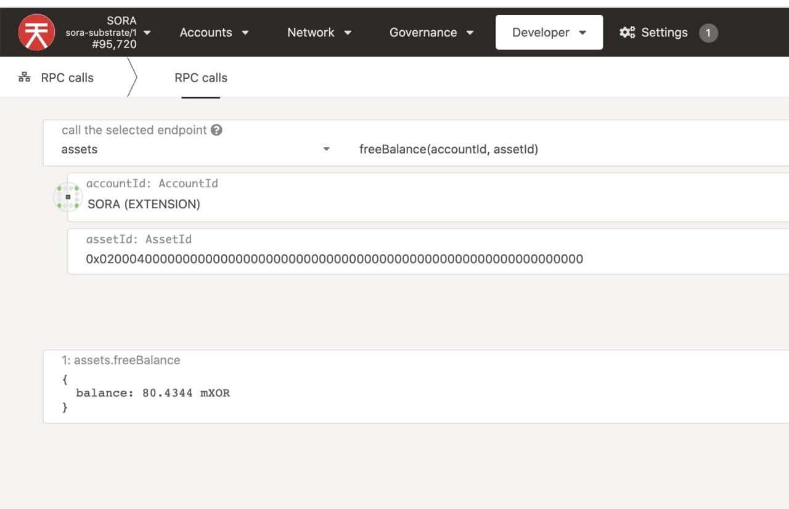

# Check user balances

### Via Polkadot.js UI

1\) Go to [SORA polkadot.js](https://polkadot.js.org/apps/?rpc=wss%3A%2F%2Fws.sora2.soramitsu.co.jp#/rpc)&#x20;

Click on "Developer" and then "RPC calls"

**Select **_**assets → freeBalance(accountid,assetid)**_** fill in AssetID and press "Submit RPC call"**

**AssetID of the desired token can be found on** [**Polkaswap** ](https://polkaswap.io/#/wallet)**in the "Account" section**

This is the expected output. In this case, the VAL amount has been checked (look at AssetID)

Unfortunately, Polkadot.js supports only one asset for the network, that's why it shows XOR, but actually, it's asset that you asked - **PSWAP, VAL, ETH, or DAI..**

Letter before XOR shows the following:

k =  x 1000&#x20;

M _=_ x 1000000&#x20;

B = x 1000000000

m = / 1000

**So, the shown amount is 80.434mXOR = 0.080434 VAL**

**For more details on how to read this output,** [**take a look at this**](how-to-check-asset-current-supply-on-sora-network.md#how-to-read-the-results)**.**
