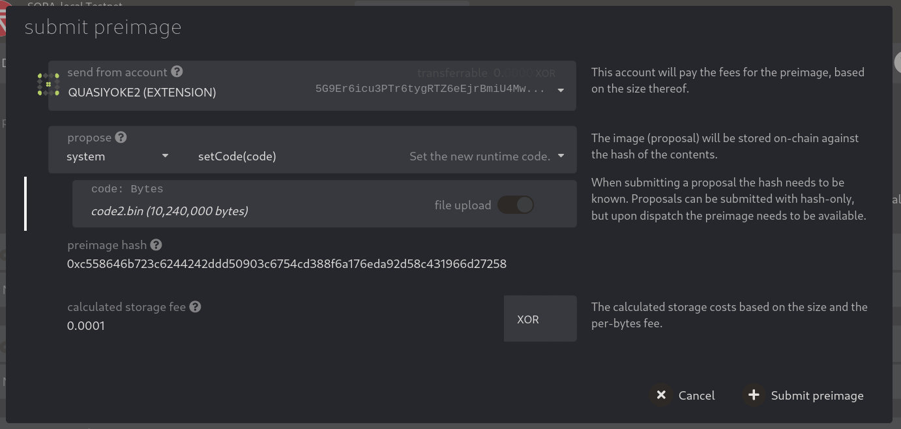
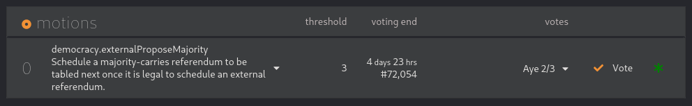
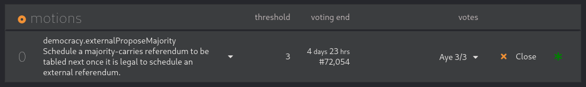
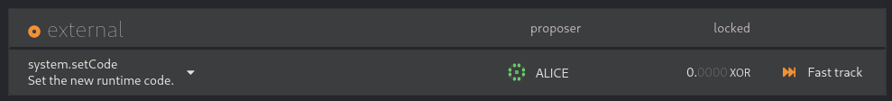
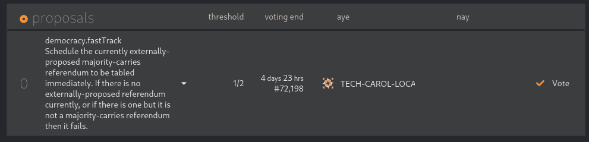
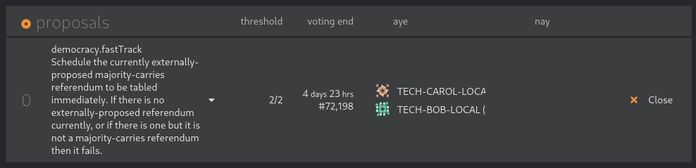
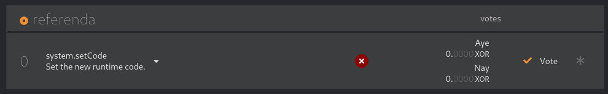

# Fast track public voting

To specify public voting duration you’ll need to communicate with the Sora Council and Sora Technical Committee.

**Step 1.** Create the preimage for the root call you’d like to perform:\
\- Go to “Governance > Democracy“ tab\
\- Press “Submit preimage“\
\- Choose the root call you’d like to perform

<figure><figcaption></figcaption></figure>

\- Copy the preimage hash\
\- Submit the preimage

**Step 2.** Create council motion:

\- Go to “Governance > Council > Motions“ tab\
\- Press “Propose external“\
\- Insert the preimage hash from step 1\
\- Submit\
\
At the “Governance > Council“ tab you should see the council motion then:

<figure><figcaption></figcaption></figure>

**Step 3.** Communicate with the Sora council regarding the voting for the council motion

**Step 4.** When the council has voted for the council motion and you’re ready for external proposal at the external proposal queue press “Close“ at the council motion and perform the `council.close` call:

<figure><figcaption></figcaption></figure>

At the “Governance“ tab you should see the external proposal:

<figure><figcaption></figcaption></figure>

**Step 5.** Create Technical committee motion using Technical committee member’s account:

\- Go to “Governance“ tab\
\- Press “Fast track“ at the external proposal\
\- Specify public voting duration and delay before the referendum enactment\
\- Submit\
\
At the “Governance / Tech. comm. / Proposals“ tab you should see the Technical committee motion then:

<figure><figcaption></figcaption></figure>

**Step 6.** Communicate with the Sora Technical committee regarding the voting for the motion at the “Governance / Tech. comm. / Proposals“ tab

**Step 7.** When the Technical committee has voted for the motion and you’re ready for public referendum press “Close“ at the Technical committee motion and perform the

`technicalCommittee.close` call:

<figure><figcaption></figcaption></figure>

At the “Governance“ tab you should see the public voting then:

<figure><figcaption></figcaption></figure>

To have time estimations for the public voting feel free to use “Network / Event Calendar“ tab.
