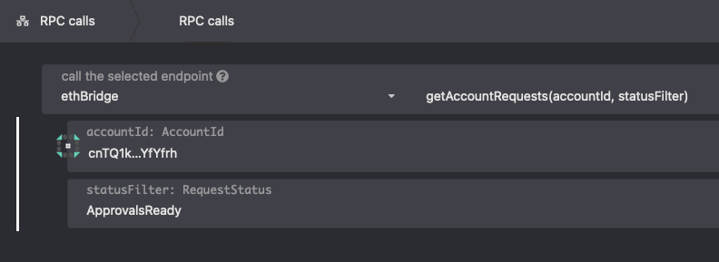
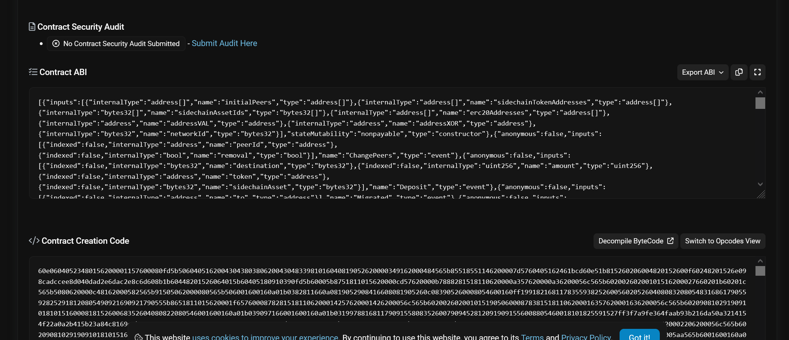
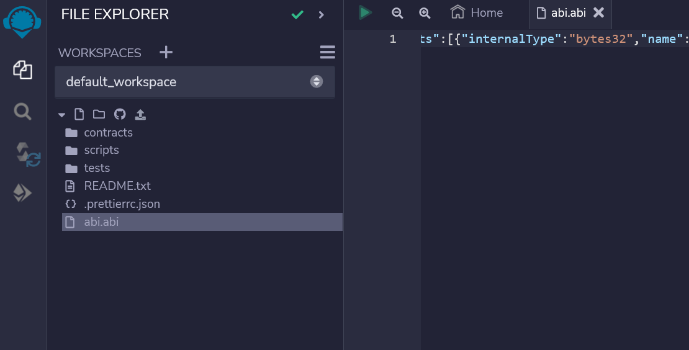
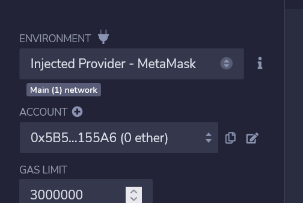
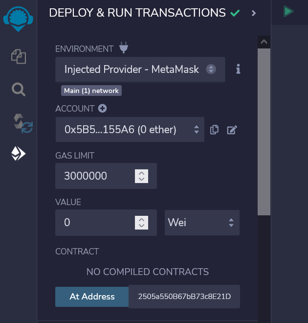
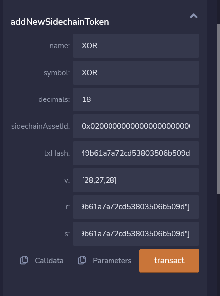
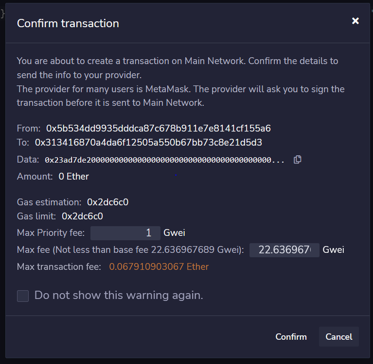
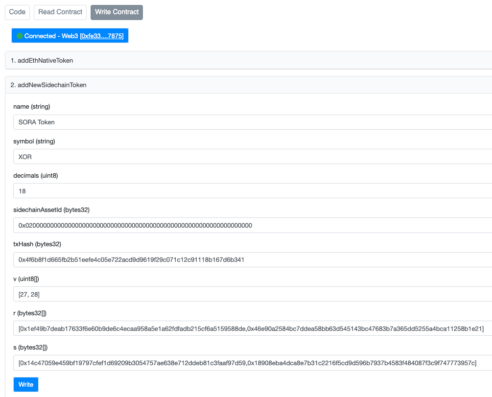
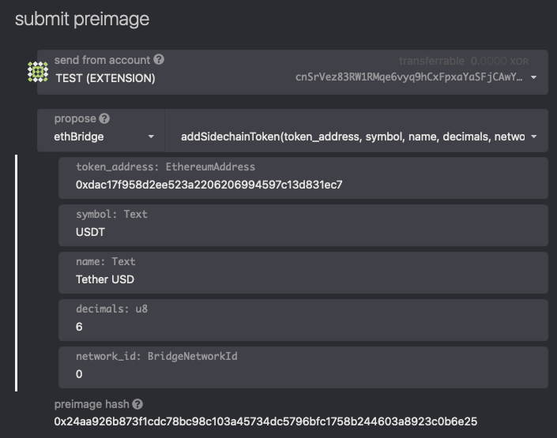
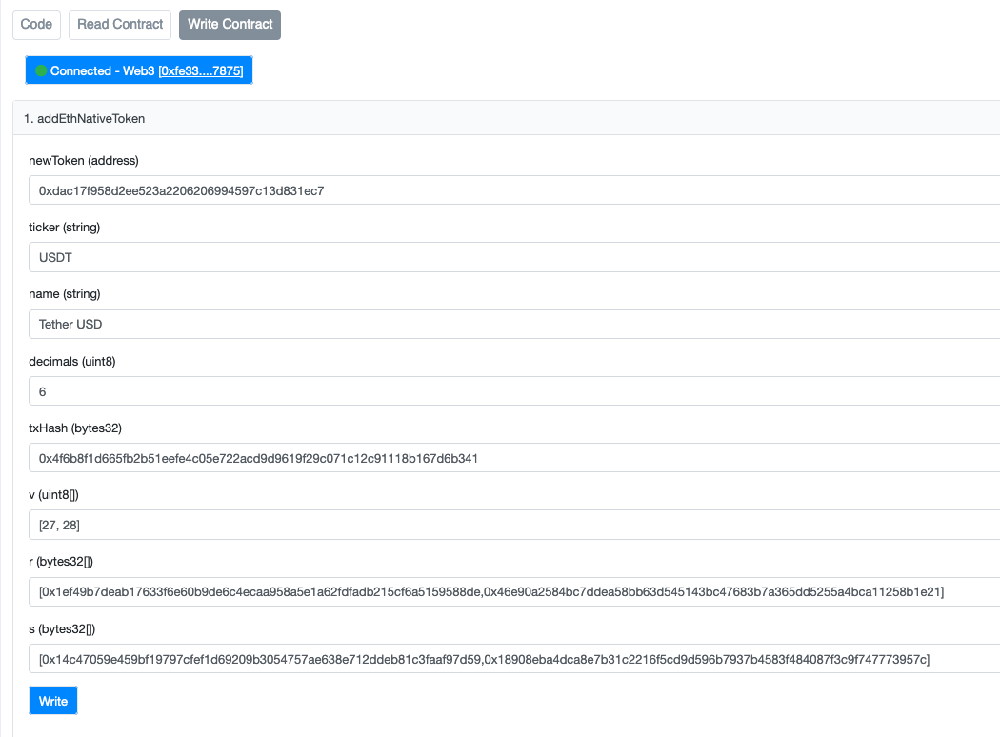

# Adding a Token to the HASHI Bridge

Adding a token to the SORA HASHI bridge involves several steps;

1. [#registering-a-token-within-the-sora-blockchain](adding-a-token-to-the-hashi-bridge.md#registering-a-token-within-the-sora-blockchain "mention")
2. [#registering-a-sora-asset-on-the-bridge](adding-a-token-to-the-hashi-bridge.md#registering-a-sora-asset-on-the-bridge "mention")
3. [#registration-of-an-erc-20-token-in-ethereum-and-its-mapping-with-a-sora-asset](adding-a-token-to-the-hashi-bridge.md#registration-of-an-erc-20-token-in-ethereum-and-its-mapping-with-a-sora-asset "mention")
4. [#optional-adding-a-wallet-to-a-whitelist](adding-a-token-to-the-hashi-bridge.md#optional-adding-a-wallet-to-a-whitelist "mention")

## Registering a token within the SORA blockchain

Please refer to [Create Your Token.md](<../../../assets/Create Your Token.md> "mention")

## Registering a SORA asset on the bridge

**Step 1.** Get the AssetId of the asset you want to add (e.g. `0x000268050a977248b641719592e7a0247ce4741839c83ec6aac6a865d3d0ba2c`).

**Step 2.** Go to [polkadot{.js}](http://polkadot.js.org/) and call the`ethBridge.addAsset` extrinsic via a fast track motion (see the steps in [fast-track-public-voting.md](../../../governance/fast-track-public-voting.md "mention")) with the asset id from the first step and network id `0` (for Ethereum).

<figure><figcaption></figcaption></figure>

**Step 3.** Once the proposal goes through, acquire the bridge’s peers' signatures via the`ethBridge.getAccountRequests` RPC with your account as the first argument and status `ApprovalsReady`.

<figure><figcaption></figcaption></figure>

**Step 4.** The RPC will return a bunch of hashes. These are off-chain request hashes, the last one should be `OutgoingAddAsset` request. To find out if the asset was added successfully, use the `getRequests` RPC.

**Step 5.** After your hash is found, use `getApprovedRequests` RPC to get the approvals.

**Step 6.** Call `addEthSidechainToken` in the bridge's smart contract

### Using remix

**Step 1.** Copy the contract ABI from the Code section on etherscan

**Step 2.** Create a file with ABI on https://remix.ethereum.org

<figure><figcaption></figcaption></figure>

**Step 3.** Choose Metamask as a provider

<figure><figcaption></figcaption></figure>

**Step 4.** Copy the contract address in the "At Address" field and click on the At Address button

<figure><figcaption></figcaption></figure>

**Step 5.** Fill in the transaction data

<figure><figcaption></figcaption></figure>

**Step 6.** Confirm

<figure><figcaption></figcaption></figure>

### Using etherscan

Access [https://etherscan.io/address/0x1485e9852ac841b52ed44d573036429504f4f602#writeContract](https://etherscan.io/address/0x1485e9852ac841b52ed44d573036429504f4f602#writeContract) and fill in the fields with data from the previous step. Note, that `v` parameters in signatures should be increased by `27`. That is, if you see `v: 0` and `v: 1`, these parameters should be passed as `[27, 28]`.

<figure><figcaption></figcaption></figure>

## Registration of an ERC-20 token in Ethereum (and its mapping with a SORA asset)

**Step 1.** Get all the necessary information about the token:

* Address (e.g. `0xdac17f958d2ee523a2206206994597c13d831ec7`)
* Symbol (e.g. `USDT`)
* Name (e.g. `Tether USD`)
* Decimals (e.g. `6`)
* Network id (e.g. `0` for Ethereum)

**Step 2.** Create a proposal (see the steps in [fast-track-public-voting.md](../../../governance/fast-track-public-voting.md "mention")) to call the `ethBridge.addSidechainToken` extrinsic with arguments from the first step.

<figure><figcaption></figcaption></figure>

**Step 3.** After the proposal is approved, acquire the bridge’s peers' signatures via the`ethBridge.getAccountRequests` RPC of the `cnTQ1kbv7PBNNQrEb1tZpmK7hZUUWqKBpWxmnxL4nczYfYfrh` account.

<figure><figcaption></figcaption></figure>

**Step 4.** The RPC will return a bunch of hashes. These are off-chain request hashes, one of them should be `OutgoingAddToken` request. To find out if the asset was added successfully, use the `getRequests` RPC.

**Step 5.** After your hash is found, use the `getApprovedRequests` RPC to get the approvals.

**Step 6.** Go to [https://etherscan.io/address/0x1485e9852ac841b52ed44d573036429504f4f602#writeContract](https://etherscan.io/address/0x1485e9852ac841b52ed44d573036429504f4f602#writeContract) and call `addEthNativeToken` with data from the previous step. Note, that `v` parameters in signatures should be increased by `27`. That is if you see `v: 0` and `v: 1`, these parameters should be passed as `[27, 28]`.

<figure><figcaption></figcaption></figure>

## (Optional) Adding a wallet to a whitelist

&#x20;If you want to be able to use the bridge functionality in Polkaswap, you need to add it to the whitelist. In order to move your token to Ethereum, it needs to be **whitelisted**. You can whitelist your token by following the instructions **** on GitHub.



First, the pull request has to be approved, then the token will be whitelisted in future updates on Polkaswap.
