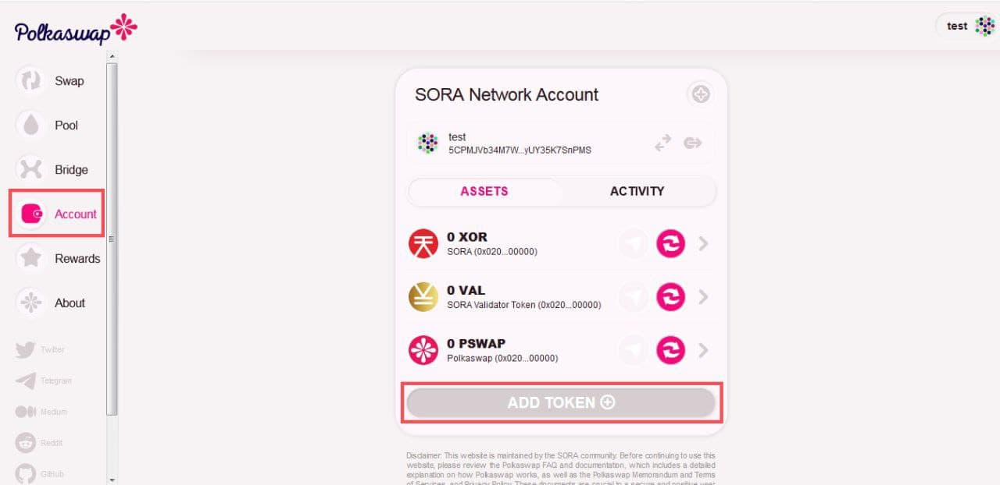

# How to Transfer Funds from Ethereum Mainnet to SORA, HASHI Bridge


Deprecated


**Important:** do **NOT** use **hardware** wallets with Polkadot.js, they are not supported yet, and move through the bridge **only** the supported tokens, that you can find [here](https://wiki.sora.org/polkaswap/tokens-id-addresses)

**Important:** if you're moving from SORA Network to Ethereum Network**, never** change the network in Metamask (for example selecting Binance Smart Chain, Matic..) until the Ethereum transaction is complete

**Important**: it is recommended to put high fees on Metamask, which will reduce the chance of your transactions getting stuck

**NOTE: after the transfer you need to add the token (click "Add Token") you've just transferred in the "Account Section". You see a step-by-step guide at the end of this tutorial.**

In order to transfer tokens successfully, you need:

* Metamask installed on your browser, with some ETH to pay gas fee
* [Polkadot.js extension](https://polkadot.js.org/extension/) installed on your browser (see how to install [here](https://wiki.sora.org/sora-academy/accounts-in-sora))

**Procedure:**

1\) **Go to** [**https://polkaswap.io/#/bridge**](https://polkaswap.io/#/bridge)

Connect to the Ethereum Mainnet via your Metamask wallet by clicking the appropriate “Connect Account" button and following the flow recommended by the Metamask extension.

Next, connect to the SORA Network via your SORA wallet by repeating the previous procedure.

To be sure that you are transferring from the Ethereum blockchain to the SORA network, check the order of input fields to make sure that the Ethereum Mainnet input field is on top, in the FROM position.

If it is not, then click the arrows between the input fields to exchange their positions. This setup ensures that you will transfer tokens from Ethereum to the SORA Network.

2\) Click the “Choose token" button, select the token to transfer between networks, and enter the token amount you want to transfer.

Then click the "Next" button and confirm your entry. Currently, only **DAI, ETH, XOR, VAL** are supported via the bridge. **Please select only tokens with icons!**&#x20;

**Note** that sometimes UI shows high fees, when they're actually lower, check on Metamask the correct amount

3\) **After you've clicked the "Confirm" button, the UI will sequentially ask you to sign transactions with the Polkadot.js and Metamask browser extensions.**

Please consider that blockchain transactions do not happen immediately, and it might take some time for the transactions to process.

You can also move tokens from the SORA Network to Ethereum by repeating this procedure in the opposite direction (i.e. with SORA Network in the FROM position).&#x20;

**After that, you'll need to add the token (click "Add Token") you've just transferred in the "Account Section".**

If you want to add DAI on Polkaswap, for example, go to the "Account" section in Polkaswap, and click on "Add Token"

Type DAI (ETH, XOR, VAL assets depending on the token you move) and then select the token, be sure you've selected the right token, looking at the logo and the [ID address](https://wiki.sora.org/polkaswap/tokens-id-addresses).

