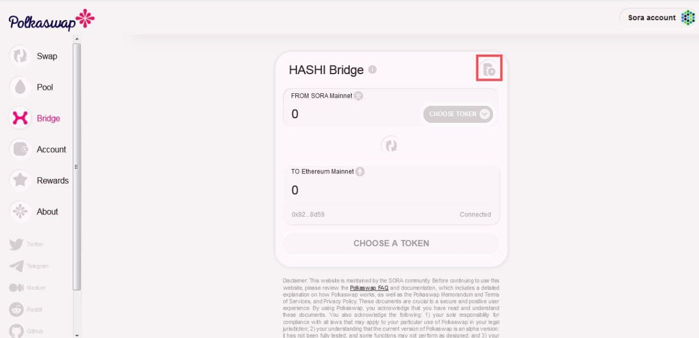

# Troubleshooting

#### **General recommendations:**

* **NO TOKENS HAVE EVER BEEN LOST.** So please be patient and look through this guide. If your issue persists after that, please ask in an official chat for support, for example, [here](https://t.me/SORAhappiness).&#x20;
* **Be wary of scammers that might contact you shortly after joining the group - admins will never DM you first.** Admins and the community will do their best to help you solve the issue as quickly as possible, so please be patient.
* If you cannot view your tokens or pooled liquidity on Polkaswap, add them manually. To do so, go to the "**Account"** section, click on "**Add asset**" and select the desired token using its icon.
* Don't use **Mathwallet/Clover** extension in the same browser as Polkaswap - these extensions do not work well together.
* **Never use hardware wallets** (such as Ledger) with Polkadot.js. If you have already moved your funds there, they're currently stuck and you can't move them until the SORA Network is supported by the respective hardware wallet. Currently, there is no ETA for integration, but developers and community members are making progress.

#### **HASHI Bridge recommendations:**


Deprecated


* If you're bridging tokens, check "**History**" in the "**Bridge**" section on Polkaswap, as shown below. If your transactions failed, you can click "**Retry".**

* Ethereum is experiencing high traffic, so the confirmation of transactions may take longer. Checkthe progress of your transactions on [Etherscan](https://etherscan.io/). When the Ethereum transaction is complete, please wait for \~7 minutes (30 blocks) for the SORA network to process that transaction. **It is recommended to always use high fees on Metamask -** that will reduce the risk of transactions getting stuck.&#x20;

#### Polkaswap recommendations

* If you're unable to perform any action or if a particular operation does not work for you (for example claiming rewards on Polkaswap.io), close and re-open the tab or change the browser you are using.
* If you're [claiming fees from Liquidity Provision](https://wiki.sora.org/guides/how-to-claim-vested-pswap), please wait up to 24 hours.
* If you performed a **swap** on Polkaswap which seems to be "**pending**" for hours, it is not actually pending, it is either failed or accepted. Check your transaction on Sorascan as explained [here](https://wiki.sora.org/guides/how-use-the-explorer). Your funds may not be stuck and already be in your wallet.
* Finally, if nothing helps, please join the [**SORA Happiness**](https://t.me/SORAhappiness) chat to report your issue and get help.
